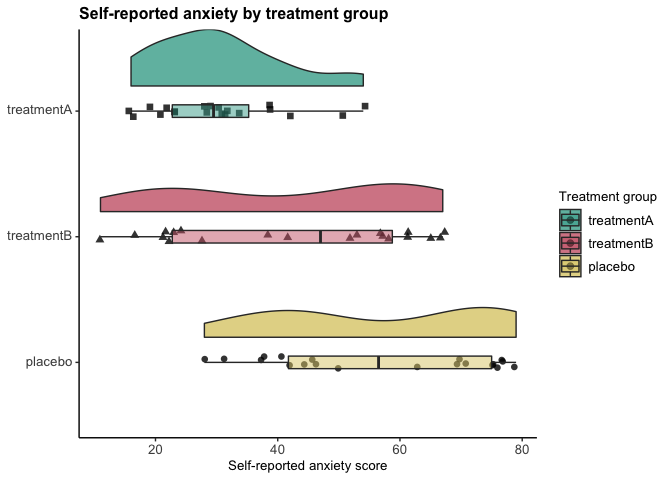

RDAPT
================
Jadyn Park
4/19/2022

``` r
## clear environment
rm(list = ls())

## load libraries
library(knitr); library(kableExtra); library(dplyr); library(ggplot2); library(ez); library(readr); library(tidyverse); library(ggpubr)

## change working directory
setwd('~/Desktop/RDAPT')

## import data
data <- read.csv("~/Desktop/RDAPT/Fake_Study_Data.csv", header=T)

head(data)
```

    ##   Subject_ID Treatment_Group Age SES Anxiety_SelfReport Anxiety_RelativeReport
    ## 1     ID0001      treatmentA  18   7                 16                     20
    ## 2     ID0002      treatmentA  20   3                 23                     16
    ## 3     ID0003      treatmentA  21   5                 22                     30
    ## 4     ID0004      treatmentA  34   3                 16                     27
    ## 5     ID0005      treatmentA  31   9                 23                     25
    ## 6     ID0006      treatmentA  29   4                 31                     18
    ##   Stress Drug_Use
    ## 1      2        1
    ## 2     12       23
    ## 3     20        4
    ## 4     19       15
    ## 5     12        3
    ## 6     19        6

``` r
## relevel so that the plot is presented in the order of treatmentA, treatmentB, placebo
data$Treatment_Group <- factor(data$Treatment_Group, levels=c("placebo", "treatmentB", "treatmentA"))

## Plot self-reported anxiety by group (treatment vs. placebo)
lowres_plot <- 
  data %>%
  ggplot(aes(x=Treatment_Group, y=Anxiety_SelfReport, fill=Treatment_Group)) + 
  geom_flat_violin(position=position_nudge(x=.2, y=0),
                   alpha=.8) +
  geom_point(aes(shape=Treatment_Group),
             position = position_jitter(width=.05),
             size=2, alpha=0.8) +
  geom_boxplot(width=.1, outlier.shape=NA, alpha=0.5) +
  coord_flip() +
  labs(title="Self-reported anxiety by treatment group",
       y="Self-reported anxiety score",
       fill="Treatment group") +
  theme_classic() +
  scale_fill_manual(values=c("#DDCC77", "#CC6677", "#44AA99")) +
  guides(fill=guide_legend(reverse=TRUE), shape=FALSE) +
  raincloud_theme

lowres_plot
```

<!-- -->

``` r
highres_plot <- 
  data %>%
  ggplot(aes(x=Treatment_Group, y=Anxiety_SelfReport, fill=Treatment_Group)) + 
  geom_flat_violin(position=position_nudge(x=.2, y=0),
                   alpha=.8) +
  geom_point(aes(shape=Treatment_Group),
             position = position_jitter(width=.05),
             size=2, alpha=0.8) +
  geom_boxplot(width=.1, outlier.shape=NA, alpha=0.5) +
  coord_flip() +
  labs(title="Self-reported anxiety by treatment group",
       y="Self-reported anxiety score",
       fill="Treatment group") +
  theme_classic() +
  scale_fill_manual(values=c("#DDCC77", "#CC6677", "#44AA99")) +
  guides(fill=guide_legend(reverse=TRUE), shape=FALSE) +
  raincloud_theme

highres_plot
```

<!-- -->
